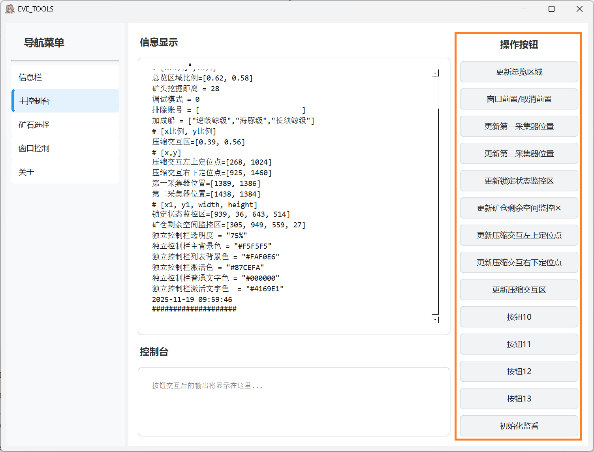
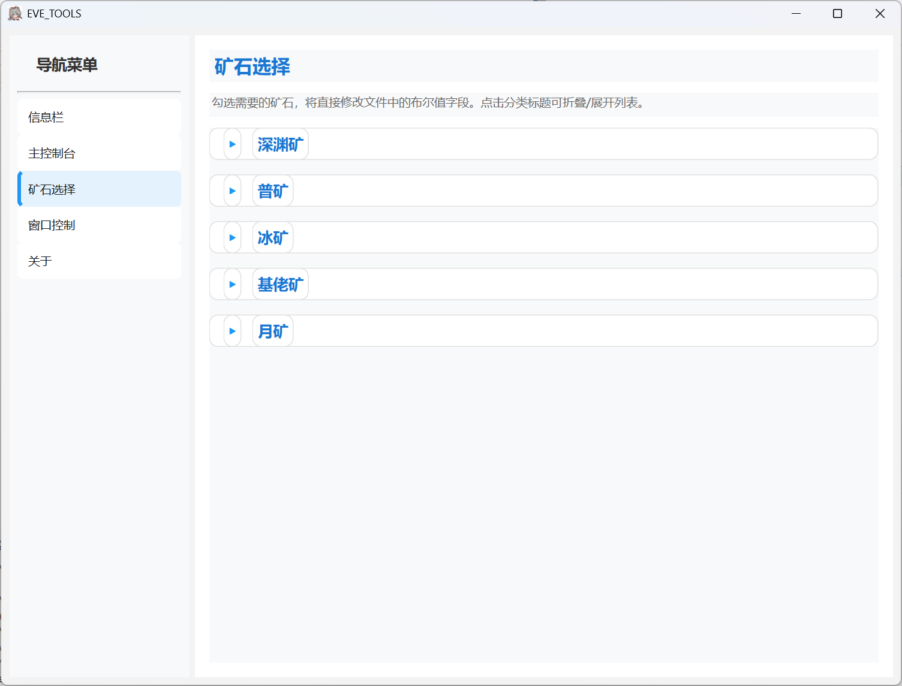
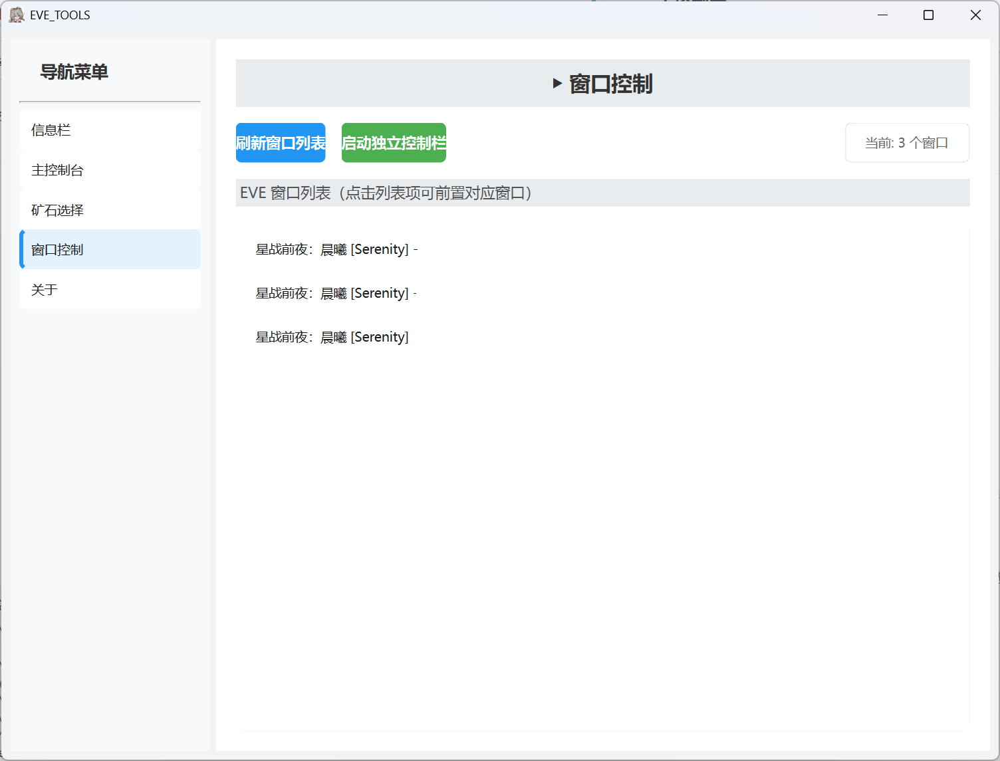
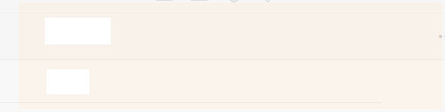

# 关于本脚本的使用说明
## 安装
- 操作步骤具体请见Readme.MD
## 使用
### 信息栏
- 在信息栏你可以快速启动控制脚本，但是请不要忘记初始化哦

### 主控制台
- 使用前请进行区域初始化

### 矿石选择
- 在矿石选择页面对你想要挖掘的矿石进行精细挑选

### 窗口控制
- 窗口控制页面内置了账号窗口快速切换功能

## 关于
- 本软件以及功能仅作学习用途，请不要将其用于正式用于公开运行的公共服务器上